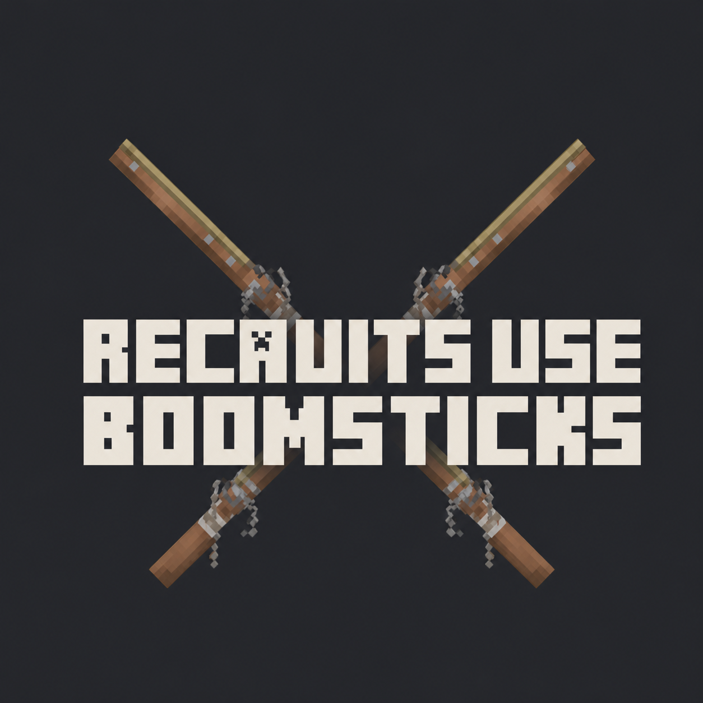

  

# Recruits Use Boomsticks

A small Forge compatibility mod that lets **Villager Recruits crossbowmen** use the firearms and heavy crossbow from **Medieval Boomsticks**.

## Compatibility

| Component | Supported version |
| --- | --- |
| Minecraft | 1.20.1 |
| Mod loader | Forge 47.4.20 or newer 47.x |
| Villager Recruits | 1.15.2 |
| Medieval Boomsticks | 1.01 |
| GeckoLib | 4.8.3–4.8.x |
| Java | 17 |

Install the mod on both the client and the dedicated server. Recruits Use Boomsticks does not bundle its dependencies; install Villager Recruits, Medieval Boomsticks, GeckoLib, and any dependencies listed by those projects.

## Supported weapons

| Weapon | Ammunition | Projectiles per shot |
| --- | --- | ---: |
| Handgonne | Round Ball | 1 |
| Arquebus | Round Ball | 1 |
| Spiked Handgonne | Round Ball | 3 |
| Arbalest | Heavy Bolt | 1 |

Crossbowmen can pick up supported weapons and ammunition, switch to them, reload, aim, fire, and respect allied-unit friendly fire rules. Ammunition consumption follows Villager Recruits' `RangedRecruitsNeedArrowsToShoot` server setting.

## Configuration

Forge creates `config/recruits_use_boomsticks-common.toml` after the first launch.

- `enabled`: enables the compatibility AI. Disabling it restores the original Villager Recruits ranged goal.
- `allowStrategicFire`: permits Villager Recruits strategic-fire positions.
- `smokeParticles`: emits extra server-synchronized smoke after a shot.
- `debugLogging`: enables additional diagnostic logging.

## Known limitations

- Only Villager Recruits **crossbowmen** use Boomsticks weapons.
- Mounted crossbowmen do not use the compatibility attack goal.
- Compatibility is intentionally limited to the versions in the table above. Other versions may change internal APIs or Mixins.

## Installation

1. Install Minecraft 1.20.1 and Forge 47.4.20 or a newer Forge 47.x build.
2. Install Villager Recruits 1.15.2, Medieval Boomsticks 1.01, GeckoLib 4.8.3–4.8.x, and their required dependencies.
3. Put `recruits_use_boomsticks-1.0.0.jar` in the `mods` folder on the client and server.

## Support

Report compatibility bugs at <https://github.com/iwosw/recruits-use-boomsticks/issues>. Include the latest log, exact mod versions, whether the issue occurs on a dedicated server, and steps to reproduce it.

## Credits and license

Villager Recruits and Medieval Boomsticks are separate projects owned by their respective authors. This project does not redistribute their assets or code.

Recruits Use Boomsticks is distributed under the terms in [LICENSE](LICENSE).
