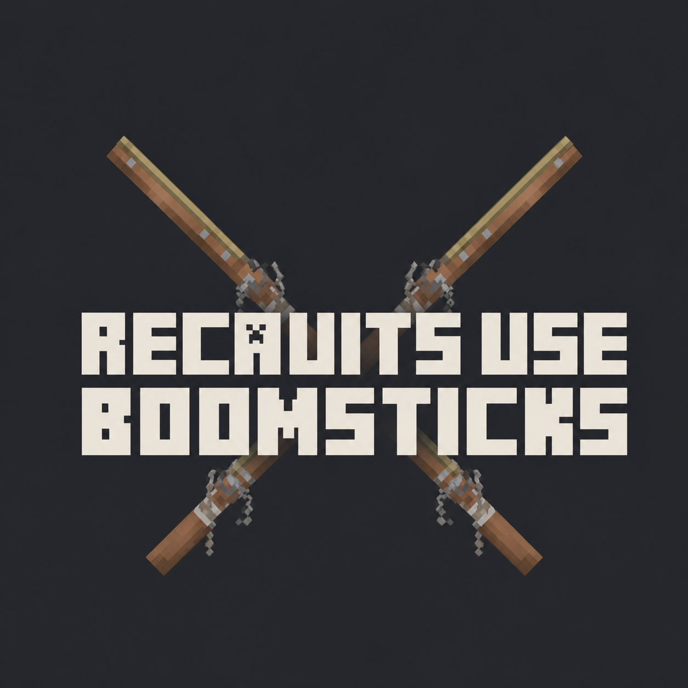

  

# Recruits Use Boomsticks

Recruits Use Boomsticks is a Minecraft Forge compatibility mod that lets Villager Recruits crossbowmen fight with Medieval Boomsticks and selected EK: Artillery Addon weapons.

Version 2.1 adds full recruit-side loading for the supported Artillery arsenal, native projectiles, throwing weapons, coordinated formation fire, improved aiming and reload animations, and company-wide **Weapons out! / Weapons away!** orders.

## Requirements

Install the mod on both the client and the server. Dependencies are not bundled in the release JAR.

| Component | Supported versions |
| --- | --- |
| Minecraft | 1.20.1 |
| Forge | 47.3.32–47.4.x |
| Java | 17 |
| Villager Recruits | 1.15.0–1.15.2 |
| Medieval Boomsticks | Optional; 1.01–1.2 |
| GeckoLib | Optional; 4.2.4–4.8.4; required by Medieval Boomsticks |
| Epic Knights | 8.2–10.11 |
| Architectury API | 9.0.8–9.2.14 |
| Cloth Config | 11.0.99–12.0.109 |
| EK: Artillery Addon | Optional; 1.11–1.13.4 or 1.15.2 |

Epic Knights: Addon is optional. It is only needed if Artillery's native Steel Francisca conversion recipe should be available.

BetterRecruitFormations is also optional. Version 2.1 is tested with it installed: a recruit turns toward its target while aiming and firing, holds the shot direction through recoil, and then returns to its previous formation direction without forgetting the target.

## Installation

1. Install Minecraft 1.20.1 and a supported Forge build.
2. Install Villager Recruits, Epic Knights, Architectury API, and Cloth Config.
3. Optionally install Medieval Boomsticks with GeckoLib, EK: Artillery Addon 1.11–1.13.4 or 1.15.2,
   and BetterRecruitFormations.
4. Put `recruits_use_boomsticks-2.1.0.jar` in the client and server `mods` folders.

Artillery Addon 1.14–1.15.1 is not supported on dedicated servers. Those upstream releases load a client-only class during server startup. Artillery 1.15.2 fixes that crash and is verified on an unpatched dedicated server.

## Supported weapons

### Medieval Boomsticks

| Weapon | Ammunition | Projectiles |
| --- | --- | ---: |
| Handgonne | Round Ball | 1 |
| Arquebus | Round Ball | 1 |
| Spiked Handgonne | Round Ball | 3 |
| Arbalest | Heavy Bolt | 1 |

### Medieval Boomsticks throwing weapons

- Iron Throwing Knife
- Iron Throwing Axe
- Small Throwing Rock
- Large Throwing Rock
- War Dart
- Javelin

Each throw spends one held item and creates that weapon's native projectile at the speed and damage the mod's own configuration gives it, and leaves the thrown weapon collectible. The War Dart and the Javelin carry their durability cost on the item a player picks back up, and break in the recruit's hand instead of throwing a spent weapon.

### EK: Artillery Addon firearms

| Weapon | Enabled branch and ammunition | Projectiles |
| --- | --- | ---: |
| Arquebus | Iron Ball | 1 |
| Matchlock Musket | Iron Ball | 1 |
| Matchlock Carbine | Iron Ball; standing and Fork Rest | 1 |
| Matchlock Pistol | Iron Ball | 1 |
| Toradar Rifle | Iron Ball | 1 |
| Mini Pistola | Small Iron Ball | 1 |
| Tiller Gun | Small Iron Ball | 1 |
| Handgonne | Iron Ball | 1 |
| Taccola Handgonne | Iron Ball branch | 1 |
| Noble Handgonne | Iron Ball preferred; Arrow fallback | 1 |
| Markmengonne | Iron Ball preferred; Arrow fallback | 1 |
| Bronze Handgonne | Iron Ball branch | 1 |
| Harquebus | Iron Ball; standing and Fork Rest | 1 |
| Hackbut | Large Iron Ball; no Fork Rest | 1 |
| Windlass Crossbow | Arrow branch | 1 |
| Hand Cannon | One Iron Ball per native three-ball volley | 3 |
| Chu Ko Nu | Eight Arrow magazine | 1 per shot |
| Double Barrel Gonne | First-barrel Iron Ball branch | 1 |

Noble Handgonne and Markmengonne prefer their native Iron Ball branches when the recruit can complete that loading chain. If no ball is available, they can use their native Arrow branches instead. Shatter Shot and Iron Bit are not enabled. Bronze Handgonne is routed by its explicit registry ID because Artillery does not include it in `#artillery:guns`.

### EK: Artillery Addon throwing weapons

- Francisca
- Hurlbat
- Throwing Cross
- Javelin
- Throwable Cobblestone

Each successful throw consumes one held item and creates that weapon's native projectile. Slow throwing weapons make the recruit walk into their real effective range before throwing.

## Combat behavior

Crossbowmen can find a supported weapon in their inventory, move it into the main hand, reload it, aim, fire, and continue fighting the same valid target after the shot.

Formation fire is coordinated per target. Recruits reserve only enough expected volley damage to defeat the target, and no more than ten physical projectiles may be committed to the same target at once. A committed reservation remains active while the projectile is in flight, preventing another rank from wasting a volley before the first shots land.

Friendly recruits, their owner, and allied entities are protected from recruit-fired supported projectiles. Multi-projectile volleys can optionally bypass Minecraft's short post-hit invulnerability window so every physical projectile deals its configured damage.

Emergency movement still wins: a recruit yields navigation while fleeing or escaping nearby primed TNT.

## Artillery loading

Supported Artillery weapons use their confirmed native loading stages instead of receiving free ammunition. Depending on the weapon, a recruit may need:

| Component | Accepted items |
| --- | --- |
| Powder | Powder flask items accepted by `minecraft:powder_flask` |
| Shot | The weapon's matching Iron Ball, Small Iron Ball, Large Iron Ball, or Arrow |
| Ramming | Bare hand, Ramrod, Iron Ramrod, or another weapon-specific native option |

Only ammunition is consumed. Powder flasks and ramrods take their normal durability damage. A recruit does not begin a loading chain it cannot finish.

The Windlass Crossbow performs its cocking sequence before loading an Arrow. Chu Ko Nu loads eight physical Arrows one at a time and fires the magazine without reloading between rounds.

## Company orders

The Villager Recruits combat command screen receives two additional buttons:

- **Weapons out!** moves a supported ranged weapon into the main hand.
- **Weapons away!** stows it in the off-hand shield slot and restores a Sword, Axe, or Crossbow when available. If this displaces an equipped shield, the next **Weapons out!** restores that exact shield, including its damage and NBT. A recruit that owns nothing else keeps the weapon in its off hand with an empty main hand, and draws it again when a fight starts.

Orders affect the selected groups. With no group selected, they affect every nearby recruit owned by the player. An active loading transaction is safely closed before an order rearranges either hand.

## Configuration

Forge creates `config/recruits_use_boomsticks-common.toml` after the first launch.

| Setting | Default | Purpose |
| --- | ---: | --- |
| `enabled` | `true` | Master compatibility switch |
| `medievalBoomsticksEnabled` | `true` | Medieval Boomsticks integration |
| `artilleryAddonEnabled` | `true` | Optional Artillery integration |
| `allowStrategicFire` | `true` | Allow Recruits strategic-fire positions |
| `smokeParticles` | `true` | Extra synchronized smoke after shots |
| `damage.projectileDamageMultiplier` | `1.0` | Global projectile damage multiplier |
| `damage.medievalBoomsticksDamageMultiplier` | `1.0` | Additional Boomsticks multiplier |
| `damage.artilleryAddonDamageMultiplier` | `1.0` | Additional Artillery multiplier |
| `damage.minimumProjectileDamage` | `10.0` | Minimum raw damage per projectile; use `0.0` for native damage |
| `damage.projectilesIgnoreHurtCooldown` | `true` | Let every projectile in a volley deal damage |
| `debugLogging` | `false` | Detailed compatibility diagnostics |

## Known limitations

- Only Villager Recruits crossbowmen use supported ranged weapons.
- Artillery support is limited to the branches listed above. It does not claim the full Artillery catalog.
- Taccola's Shatter Shot, Iron Bit, and Arrow branches are disabled.
- Noble's Shatter Shot and Iron Bit branches are disabled.
- Double Barrel Gonne uses only its first Iron Ball barrel.
- Grenades are excluded because their native ownerless explosions cannot participate in recruit allied-fire protection.
- Artillery 1.14–1.15.1 is excluded from the dedicated-server version range because of its upstream client-class crash.

## Verification

The release gate uses focused unit tests, real Forge dedicated-server GameTests, an optional-dependency run without Artillery, dependency-range matrix runs, and a release-JAR content check. The current harness contains 163 unit tests and 137 required GameTests.

Detailed Artillery evidence and exact runtime boundaries are recorded in [the compatibility verification report](docs/compat/artillery-addon-compatibility-verification.md).

## Support

Report compatibility bugs at <https://github.com/iwosw/recruits-use-boomsticks/issues>. Include the latest log, exact mod versions, whether the problem occurs on a dedicated server, and steps to reproduce it.

## Credits and license

Villager Recruits, Medieval Boomsticks, Epic Knights, EK: Artillery Addon, and BetterRecruitFormations are separate projects owned by their respective authors. This project does not redistribute their assets or code.

Recruits Use Boomsticks is available under the [MIT License](LICENSE).
